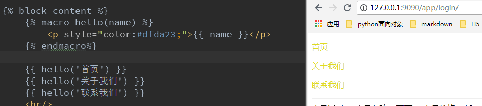
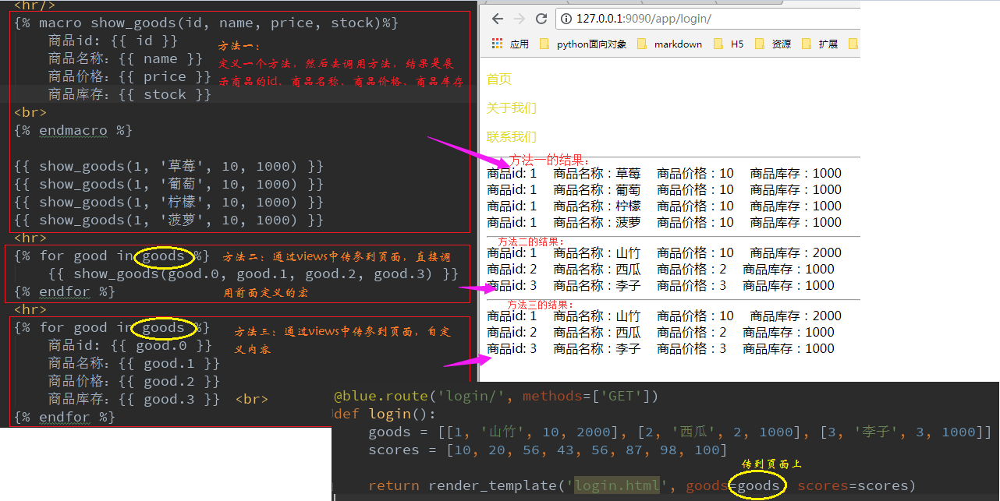
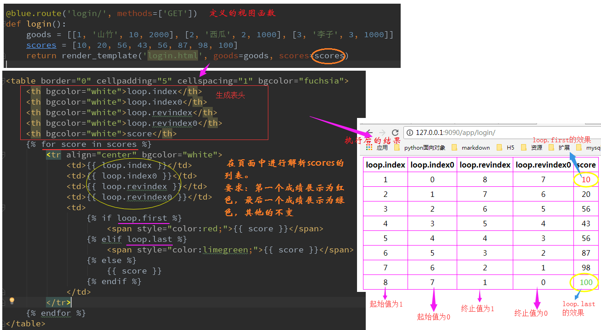

<pre>
<h3>该文档总结</h3>
1.cookie和session

原因：http是个无状态协议
    a) 无法标记当前用户登录状态
    b) 无法标记访问网站的用户是否为同一个人

解决办法：使用cookie和session
    a) 在cookie中存入某个随机的标识符
    b) 在服务端也存入相应的标识符

解决过程：
    a) 从客户端发送request请求，并带cookie传入到后端
    b) 服务端中，会拿到request中的cookie中的标识符，然后在后端进行匹配查找，
    如果查找到相应的标识符，则获取在服务端中存入的数据

使用session存储数据：
    redis、memachaed、filesystem、sqlalchemy等等

配置redis:
    a) SESSION_TYPE ===> redis
    b) SESSION_REDIS ===> redis.Redis(host, port)
    c) 第一种：
        Session(app=app)
       第二种：
        sess = Session()
        sess.inin_app(app)

使用session：
    a) 存数据 session['key'] = value
    b) 删数据 session.pop('key')
    c) 清空所有数据 session.clear()

2. jinja2模板

    模板渲染
        a) 挖坑填坑  
        b) 填坑时要保留挖坑的内容 {{ super() }}
        c) 继承,引入挖坑模板 
        d) 包含 

    数据加载：
        a) 解析标签 , for、 if、 没有ifequal
        b) 解析参数 {{ var }}
        c) macro 宏定义
            c1) 可以定义函数。
            c2) 调用 

    数据过滤：
        a) 解析带样式的content_h2的字符串，使用safe过滤器 {{ content_h2|safe }}
        b) trim:去掉空格
        c) length: 长度
        d) lower: 小写
        e) upper: 大写
        ...

    static加载：
        a) 第一种加载css方式
            <link rel="stylesheet" href="/static/css/xxx.css">
        b) 第二种
            <link rel="stylesheet" href="{{ url_for('static', filename='css/xxx.css') }}">
</pre>

## 前言

　访问者的标识问题服务器需要识别来自同一访问者的请求。这主要是通过浏览器的cookie实现的。 访问者在第一次访问服务器时，服务器在其cookie中设置一个唯一的ID号——会话ID(session)。 这样，访问者后续对服务器的访问头中将自动包含该信息，服务器通过这个ID号，即可区 别不同的访问者。

### 1.Cookie

#### 1.1 创建
Cookie是通过服务器创建的Response来创建的。

#####设置：
   set_cookie('key', value, max_ages='', expires='')

#####删除，有三种删除方式：
	
 1. 直接清空浏览器的cookie
 2. del_cookie('key') 直接使用del_cookie函数
 3. set_cookie('key','',expires=0) 重新设置key的值为空，过期时间为0
 
#####获取：

　在每次请求中，url都会向服务器传递Request，在request中可以获取到cookie的信息。 
　request.cookies.get('name')

#####1.2例子：
<pre>
# 1. 设置cookie

@blueprint.route('cookies/', methods=['GET'])
def get_cookies():

    response = make_response('&lt;h3>Hello World&lt;/h3>', 200)
    response.set_cookie('session_id', '1234567890', max_age=200)
    
    return response

# 2. 删除cookie中的值
@blueprint.route('del_cookies/', methods=['GET'])
def del_cookies():
    res = make_response('&lt;h3>Hello World&lt;/h3>', 200)

    # 1. delete_cookie删除cookie中的key
    # res.delete_cookie('session_id')

    # 2. set_cookie,max_age=0,expires=0
    res.set_cookie('session_id', '1234567890', max_age=0)
    return res

# 3. 获取cookie中的值
@blueprint.route('/getcookie/')  
def get_cookie():
    name=request.cookies.get('name')  
    return name
</pre>

### 2.Session

flask-session是flask框架的session组件，该组件将支持session保存到多个地方，如：

    redis: 非关系型数据库
    memcached
    mongodb
    sqlalchmey: 把数据存到数据库表里面

####2.1 安装flask-session和redis

    pip install flask-session

如果指定存session的类型为redis，需要安装redis

    pip install redis

####2.2 语法

##### 设置session

session['key'] = value

##### 读取session

result = session['key']       # 如果内容不存在，将会报异常

result = session.get('key')     # 如果内容不存在，将返回None

##### 删除session

session.pop('key')

##### 清空session中所有数据：

session.clear()

#### 2.3 使用
待补充

### 3. jinja2

Flask中使用jinja2模板引擎

####3.1 模板语法

模板语法主要分为两种：变量和标签。

##### 3.1.1 变量和标签的格式

变量：{{ var }}  
标签：
> 变量： 是视图传递给模板的数据；或是模板中定义出来的数据；当变量不存在时，默认忽略。 
> 标签： 是控制逻辑；使用外部表达式；创建变量；宏定义(macro)

##### 3.1.2 结构标签

1.定义html父模板：block，格式：

    

    

进行块操作，父模板挖坑，子模填坑。例如：

<pre>
==== 挖坑：base.html

&lt;!doctype html>
&lt;html>
    &lt;head>
       &lt;title>
            

            
        &lt;/title>

        

        

    &lt;/head>

    &lt;body>
        
		你好~
        
    &lt;/body>

&lt;/html>

</pre>
2.引用模板：extends

super() :保留父模板中的挖坑中的内容. 在Django中使用的是：block.super()

<pre>
=== 填坑: base_main.html


    ｛# 注意引入格式: url_for() #}
    &lt;link rel="stylesheet" href="{{ url_for('static', filename='css/main.css') }}">





    填坑页面案例



    {{ super() }} 
    方便的填坑操作


</pre>

3.宏：macro

- 宏定义，可以在模板中定义函数，在其他地方调用函数
<pre>



    
	&lt;p style="color:#dfda23;">{{ name }}&lt;/p>
    

    {{ hello('首页') }}
    {{ hello('关于我们') }}
    {{ hello('联系我们') }}

</pre>

- 灵活应用定义的宏，例如：(见图片)

 - 引入外部定义的宏方法

格式：

在function.html中定义宏方法以，在login.html中引入function.html中定义的方法。

#####3.1.3 循环(for , loop)

格式：
<pre>

     内容

</pre>
也可以获取循环信息: loop
<pre>
loop.first --> bool值，如果是第一次循环，结果为真

loop.last  --> bool值，如果是最后一次循环，结果为真

loop.index --> 每循环一次生成一个序号，序号起始值为1

loop.index0 --> 每循环一次生成一个序号，序号起始值为0

loop.revindex --> 每循环一次生成一个序号，序号终止值为1

loop.revindex --> 每循环一次生成一个序号，序号终止值为0

变量	                内容
loop.index	循环迭代计数（从1开始）
loop.index0	循环迭代计数（从0开始）
loop.revindex	循环迭代倒序计数（从len开始，到1结束）
loop.revindex0	循环迭代倒序计数（从len－1开始，到0结束）
loop.first	是否为循环的第一个元素
loop.last	是否为循环的最后一个元素
loop.length	循环序列中元素的个数
loop.cycle	在给定的序列中轮循，如上例在”odd”和”even”两个值间轮循
loop.depth	当前循环在递归中的层级（从1开始）
loop.depth0	当前循环在递归中的层级（从0开始）
</pre>

#####3.1.4 过滤器

格式： {{ var|过滤器|过滤器... }}

 - 字符串操作
 
<pre>
1. safe：禁用转义
   {{ '<em>hello</em>' | safe }}

2. capitalize：把变量值的首字母转成大写，其余字母转小写
   {{ 'hello' | capitalize }}

3. lower：把值转成小写      
   {{ 'HELLO' | lower }}

4. upper：把值转成大写       
   {{ 'hello' | upper }}

5. title：把值中的每个单词的首字母都转成大写 
   {{ 'hello' | title }}

6. reverse：字符串反转
   {{ 'olleh' | reverse }}

7. format：格式化输出       
   {{ '%s is %d' | format('name',17) }}

8. striptags：渲染之前把值中所有的HTML标签都删掉 
   {{ '<em>hello</em>' | striptags }}

9. truncate: 字符串截断           
   {{ 'hello every one' | truncate(9)}}
</pre>
 - 列表操作
<pre>
1.first：取第一个元素 
   {{ [1,2,3,4,5,6] | first }}

2. last：取最后一个元素
   {{ [1,2,3,4,5,6] | last }}

3. length：获取列表长度       
   {{ [1,2,3,4,5,6] | length }}

4. sum：列表求和         
   {{ [1,2,3,4,5,6] | sum }}

5. sort：列表排序            
   {{ [6,2,3,1,5,4] | sort }}
</pre>

**自定义过滤器**

　　过滤器的本质是函数。当模板内置的过滤器不能满足需求，可以自定义过滤器。自定义过滤器有两种实现方式：

 - 一种是通过Flask应用对象的 add_template_filter 方法
 - 通过装饰器来实现自定义过滤器
 
> 注意：自定义的过滤器名称如果和内置的过滤器重名，会覆盖内置的过滤器。

需求：添加列表反转的过滤器

方式一 
　　通过调用应用程序实例的 add_template_filter 方法实现自定义过滤器。该方法第一个参数是函数名，第二个参数是自定义的过滤器名称：

<pre>
def do_listreverse(li):
    # 通过原列表创建一个新列表
    temp_list = list(li)
    # 将新列表进行返转
    temp_list.reverse()
    return temp_list
 
app.add_template_filter(do_listreverse,'lireverse')
</pre>

方式二 
　　用装饰器来实现自定义过滤器。装饰器传入的参数是自定义的过滤器名称。
<pre>
@app.template_filter('lireverse')
def do_listreverse(li):
    # 通过原列表创建一个新列表
    temp_list = list(li)
    # 将新列表进行返转
    temp_list.reverse()
    return temp_list
</pre>

####3.2 静态文件信息配置

##### Django

方法一：

    
    <link rel="stylesheet" href="">

方法二：

    <link rel="stylesheet" href="/static/css/index.css">

Flask:

方法一：

    <link rel="stylesheet" href="/static/css/index.css">
方法二：

    <link rel="stylesheet" href="{{ url_for('static', filename='css/index.css') }}">