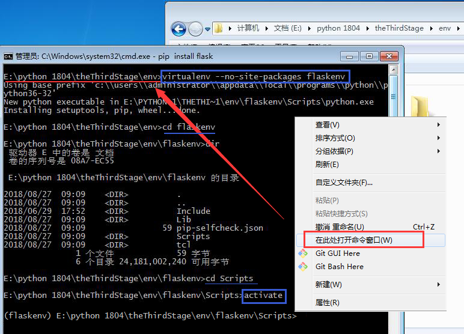
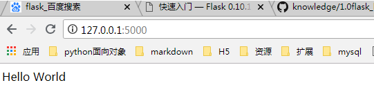
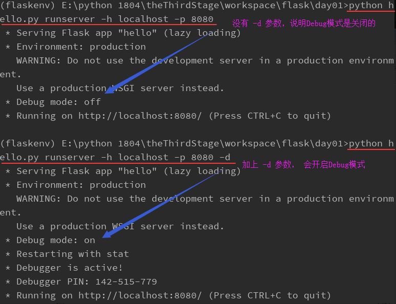
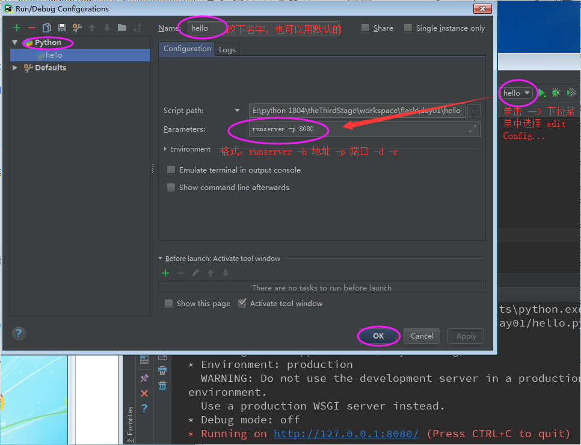
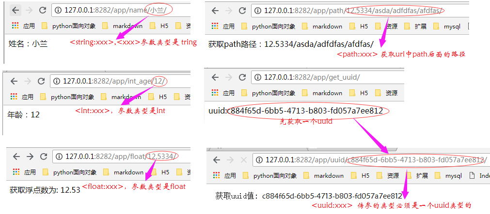
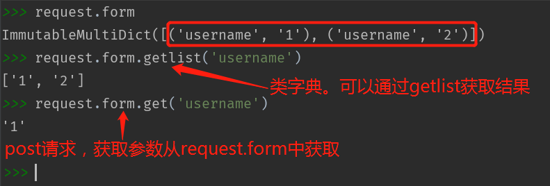

#flask-day1

<pre>
<h2>知识点总结</h2>
1. virtualenv虚拟环境
2. flask ‘微'型web框架，异步

from flask import Flask
app = Flask(__name__)

@app.route('/')
def hello():
    return 'hello world'

if __name__ = '__main__':
    app.run()

a）运行 默认ip：端口 ===> 127.0.0.1:5000
b ) app.run(host=127.0.0.1, port=8080, debug=True)

3. 管理启动的app   启动命令优化
安装： pip install flask-script
使用： 
        from flask_script import Manger
        manage = Manager(app=app)
启动：
       manage.run()
启动命令：
       python manage.py runserver -d -p 8080 -h 127.0.0.1

4.管理路由
安装： pip install flask-blueprint
使用： from flask import Blueprint
   第一步：初始化
   blue = Blueprint('app', __name__)
   
   @blue.route('hello/')
   def hello():
        return '123'

    第二步：注册
    app.register_blueprint(blueprint=blue, url_prefix='/app')

访问hello()方法， url为：127.0.0.1:8080/app/hello/

5. 反向解析
    url_for('蓝图的第一个参数.跳转到某个函数的函数名')

6.route规则
&lt;string:name&gt; 等同于 &lt;name&gt;
&lt;int:id&gt;
&lt;float:id&gt;
&lt;path:path&gt;
&lt;uuid:uuid&gt;

7.请求与响应
request请求：
    a) GET请求： 获取参数，request.args.get()
    b) POST, PUT, PATCH, DELETE请求： 获取参数， request.form.get()
    c) 获取重复key的value值，使用request.form.getlist(key)

response响应：
    a) make_response() 创建response对象
    b) 绑定cookie, set_cookie(key, value, max_age/expires)， delete_cookie(key)

8.异常抛出与捕获
from flask import abort
抛出： abort(500)
捕获：blue.errorhandler(500)
</pre>

####1.flask介绍
Flask是一个基于Python实现的web开发的'微'框架。

[中文文档地址](http://docs.jinkan.org/docs/flask/)

Flask和Django一样，也是一个基于MVC设计模式的Web框架
flask流行的主要原因:
<pre>
a)  有非常齐全的官方文档，上手非常方便
b)  有非常好的拓展机制和第三方的拓展环境，工作中常见的软件都有对应的拓展，自己动手实现拓展也很容易
c)  微型框架的形式给了开发者更大的选择空间
</pre>

####  2.安装flask

##### 虚拟环境搭建

选择创建虚拟环境的路径，shift+右击-->在此处打开命令窗口，进入到Dos命令窗口。执行以下命令

    virtualenv --no-site-packages flaskenv   
    cd flaskenv/Scripts
    activate.bat   # 激活虚拟环境
>  pip list　　# 查看系统已安装上了很多三方库<br>
    格式：virtualenv --no-site-packages 文件夹名 <br>
    说明：--no-site-packages 这个参数加上，可以使虚拟环境很纯洁，不会把系统上已安装的那些三方库安装到虚拟环境中



##### 安装

    pip install flask

####3.基于flask的最小的应用

创建hello.py文件

<pre>
from flask import Flask

# 初始化
app = Flask(__name__)

# 定义路由，绑定视图函数
@app.route('/')
def hello():
    return 'Hello World'


# 服务启动
if __name__ == '__main__':

    app.run()
</pre>

运行：python hello.py


>@app.route('/') <br>
> 　在Flask应用程序中定义路由最便捷的方式是通过显示定义在应用程序实例之上的app.route装饰器，注册被装饰的函数来作为一个 路由。<br>
> hello() <br>
> 　类似于hello()的函数被称作 视图函数,示例中给应用程序的根URL注册hello()函数作为事件的处理程序。执行 python hello.py后，在浏览器地址栏中输入http://127.0.0.1:5000/将触发helo()来运行服务。客户端接收到这个函数的返回值被称为响应。



**服务启动**
<pre>
if __name__ == '__main__':

    app.run()
</pre>

　有几个选项参数可以给app.run()配置web服务的操作模式。在开发期间，可以很方便的开启debug模式，将激活 debugger 和 reloader 。这样做是通过传递debug为True来实现的。run()中参数有如下：

    debug 是否开启调试模式，开启后修改python的代码会自动重启

    port 启动指定服务器的端口号

    host主机，默认是127.0.0.1

    如写成：app.run(port=8080, host='localhost', debug=True)


####4.修改启动方式，使用命令行参数启动服务

    if __name__ == '__main__':
        app.run(port=8080, host='127.0.0.1', debug=True)

像以上这样在项目启动的端口和地址固定写在代码中是不好的，所以需要修改启动方式。

#####4.1安装插件

    pip install flask-script

调整代码：

<pre>
from flask_script import Manager   # 导包
app = Flask(__name__) 下方加入：

# 使用Manager管理Flask的对象
manager = Manager(app=app)


if __name__ == '__main__':
    <s>app.run(port=8080, host='127.0.0.1', debug=True)</s>
    manager.run()
</pre>

#####4.2 启动命令
 
    python manage.py runserver -h 地址 -p 端口 -d -r

其中：

```-h 地址 :``` 地址是给一个ip地址，如 -h 127.0.0.1<br>
```-p 端口:``` -p 后面给一个端口号，如 -p 8080 <br>

```-d  : ``` 表示debug模式。<br>
```-r :```   表示自动重启



为了避免每次运行时都要输入命令来启动服务，可以进行配置。(截图中使用的是pycharm软件)


####5.蓝图

　　在Flask项目中可以用Blueprint(蓝图)实现模块化的应用，使用蓝图可以让应用层次更清晰，开发者更容易去维护和开发项目。蓝图将作用于相同的URL前缀的请求地址，将具有相同前缀的请求都放在一个模块中，这样查找问题，一看路由就很快的可以找到对应的视图，并解决问题了。

#####5.1 安装

    pip install flask_blueprint

##### 5.2 实例化蓝图应用 

<pre>
from flask import Blueprint

# 1. 初始化蓝图，定义两个参数
blueprint = Blueprint('first', __name__)
</pre>

> 注意：Blueprint中传入了两个参数，第一个是蓝图的名称，第二个是蓝图所在的包或模块，__name__代表当前模块名或者包名

#####5.3注册

<pre>
app = Flask(__name__)

# 2.注册蓝图   -->类似django工程目录下的urls.py
app.register_blueprint(blueprint=blueprint, url_prefix='/app')
</pre>

> 注意：第一个参数即我们定义初始化定义的蓝图对象，第二个参数url_prefix表示该蓝图下，所有的url请求必须以/user开始。这样对一个模块的url可以很好的进行统一管理

#####5.4使用蓝图

修改视图上的装饰器，修改为@blueprint.router('/')
<pre>
<s>@app.router('/')</s>

@blueprint.router('/')  
def hello():

    return 'Hello World'
</pre>
>注意：<br>
>  --1. 该方法对应的url为 127.0.0.1:5000/user/ (127.0.0.1:5000是默认的ip和端口，如果进行了配置，要使用自己配置的ip和端口，后面才是/user/) <br>
> -- 2. @blueprint.router('/')，router()中没有传methods参数，默认是methods=['GET'],也可写成 @blueprint.router('/', methods=['GET']). <br>
> -- 3.  <pre>@blueprint.router('/')
> def hello():</pre>是一体的，中间不能有空行。

##### 5.5反向解析

**语法：**

    url_for('蓝图中定义的第一个参数.函数名', 参数名=value)

例1：
定义跳转方法，跳转到@blueprint.router('/')路由上去
<pre>
@blueprint.route('redirect/')
def index():
    # 跳转到@blueprint.router('/')路由, 实现跳转到访问 hello方法
    return redirect('/')

    # 如果有一个路由是：@blueprint.router('get_request/')
    # return redirect('get_request/')

</pre>


<pre>
@blueprint.route('redirect/')
def index():
    # 跳转：反向解析--》 蓝图第一个参数.视图名； 实现跳转到访问 hello方法
    return redirect(url_for('first.hello'))
</pre>

<pre>
代码：
===============  day01/manage.py  ===============

from flask import Flask
from flask_script import Manager
from app.views import blueprint

# 初始化一个Flask对象
app = Flask(__name__)

# 2.注册蓝图   -->类似django工程目录下的urls.py
app.register_blueprint(blueprint=blueprint, url_prefix='/app')

# 使用Manager管理Flask的对象
manager = Manager(app=app)

if __name__ == '__main__':
    manager.run()


================== day01/app/views.py  ===========================

from flask import Blueprint, redirect, url_for
blueprint = Blueprint('first', __name__)

# @app.route('/')
@blueprint.route('/')
def hello():
    return 'Hello World'


# 访问：http://127.0.0.1:8282/app/redirect/ -->跳转访问 http://127.0.0.1:8282/app/
@blueprint.route('redirect/')
def index():
    # 跳转：反向解析--》 蓝图第一个参数.视图名； 实现跳转到访问 hello方法
    return redirect(url_for('first.hello'))
</pre>

####6.route规则

####6.1规则

**格式：** <converter:variable_name>

**说明：**

　用尖括号(<>)括起来的部分是**动态**的部分，所以任何URLs匹配到静态部分都将映射到这个路由。当视图函数被调用，Flask发送动态组件作为一个参数。在前面的示例的视图函数中，这个参数是用于生成一个个性的问候作为响应。

　在路由中动态组件默认为字符串string，但是可以定义为其他类型。

converter类型：

1. <code><string:xxx> </code>　获取到xxx的参数的值为字符串类型
2. <code><xxx\></code>　 默认获取到xxx的参数的值为字符串类型
3. <code><int:xxx> </code>获取到的xxx参数的值为整数类型
4. <code><float:xxx></code> 获取到的xxx参数的值为浮点类型
5. <code><path:xxx> </code>获取到的xxx为路径后面全部的url地址
6. <code><uuid:xxx> </code>获取到的xxx的值, uuid的值为 c884f65d-6bb5-4713-b803-fd057a7ee812  需导包import uuid


#####6.2 采用动态名称组件路由

例1：<string:xxx>,<xxx\> 参数类型是string，string是默认的参数类型

访问：http://127.0.0.1:8282/app/name/小兰/
<pre>
@blueprint.route('name/<s_name>/')
def get_name(s_name):
    return '姓名：%s' % s_name
</pre>

例2：<int:xxx>，参数类型是int

访问：http://127.0.0.1:8282/app/int_age/12/

访问：http://127.0.0.1:8282/app/int_age/dfd/ --》报错 404, Not Found
访问：http://127.0.0.1:8282/app/int_age/13.32/ --》 404, Not Found

<pre>
@blueprint.route('int_age/<int:age>/')
def get_int_age(age):
    return '年龄：%d' % age
</pre>

例3：<float:xxx>，参数类型是float

访问：http://127.0.0.1:8282/app/float/12.5334/

<pre>
@blueprint.route('float/<float:number>/')
def get_float_number(number):
    return '获取浮点数为: %.2f' % number
</pre>

例4：<path:xxx> 获取到的xxx为路径后面的全部的url地址

访问：http://127.0.0.1:8282/app/path/12.5334/asda/adfdfas/afdfas/

<pre>
@blueprint.route('path/<path:s_path>')
def get_path(s_path):
    return '获取path路径：%s' % s_path
</pre>

例5：先获取uuid

访问：http://127.0.0.1:8282/app/get_uuid/
结果：uuid:c884f65d-6bb5-4713-b803-fd057a7ee812

<pre>
@blueprint.route('get_uuid/')
def get_uuid():
    a = uuid.uuid4()
    return 'uuid:%s' % str(a)
</pre>

例5' ：<uuid:xxx> 
访问：http://127.0.0.1:8282/app/uuid/c884f65d-6bb5-4713-b803-fd057a7ee812/ 
说明：传参必须是一个uuid类型的

<pre>
@blueprint.route('uuid/<uuid:s_uuid>/')
def get_by_uuid(s_uuid):
    return '获取uuid值: %s' % s_uuid
</pre>




####7.请求与响应

请求：客户端传到服务端（浏览器-->后台<br>
响应： 服务端返回给客户端，比如设置cookie值

##### 7.1请求request

服务端在接收到客户端的请求后，会自动创建Request对象。

由Flask框架创建，Requesy对象不可修改。

属性：
<pre>
url：完整的请求地址

base_url：去掉GET参数的url

host_url：只有主机和端口号的url

path：路由中的路径

method：请求方法

remote_addr：请求的客户端的地址

args：GET请求参数

form：POST请求参数

files：文件上传

headers：请求头

cookies：请求中的cookie
</pre>

 - 常用的请求类型有以下几种：
  - GET : 获取
  - POST : 创建
  - PUT : 修改(全部属性都修改)
  -  DELETE : 删除
  - PATCH : 修改(修改部分属性)

<pre>
@blueprint.route('request/', methods=['GET', 'POST', 'PUT', 'PATCH', 'DELETE'])
def get_request():

    request   # 断点调试
    return '我是请求，用postman调试'
</pre>
注意：请求方式不同，获取值时有些不一样

 - GET请求：
  -  获取get请求中的参数，使用request.**args**.get(key) 
  -  **args**是get请求参数的包装，args是一个**ImmutableMultiDict**对象，类字典结构对象. 数据存储也是key-value
 -  POST/ PUT/ PATCH/ DELETE请求：
  -  获取post请求中的参数，使用request.**form**.get(key)
  -  **form**是post请求参数的包装，args是一个**ImmutableMultiDic**t对象，类字典结构对象. 数据存储也是key-value
 - 获取重复key的value值：
  - 使用request.form.**getlist**(key)
 - 重点：ImmutableMultiDict
  - 是类似字典的数据结构，但是与字典的区别是，可以存在相同的键。


##### 7.2响应response

**创建响应**

 格式：make_reponse(data，code)，其中data是返回的数据内容，code是状态码

访问：http://127.0.0.1:8282/app/response/

    from flask import make_response

    @blueprint.route('response/', methods=['GET'])
    def get_response():
        # return 'hello 你好', 200

        res = make_response('<h2>我是响应</h2>', 200)
        return res

#### 8.异常的抛出与捕获

自动抛出异常：abort(状态码)<br>
捕获异常处理：errorhandler(状态码)，定义的函数中要包含一个参数，用于接收异常信息

#####8.1定义终止程序
<pre>
from flask import abort

@blueprint.route('error/', methods=['GET'])
def error():
    a = 9
    b = 0
    try:
        c = a / b
    except:
        # 抛异常
        abort(500)
    return '%s / %s = %s' % (a, b, c)
</pre>

#####8.2捕获定义的异常

<pre>
# 捕获异常
@blueprint.errorhandler(500)
def handler_500(exception):
    return '捕捉的异常信息：%s' % exception
</pre>